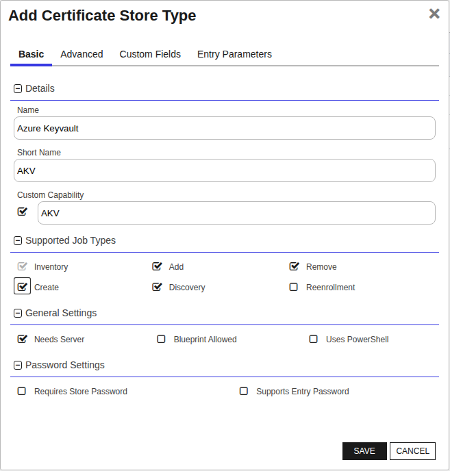
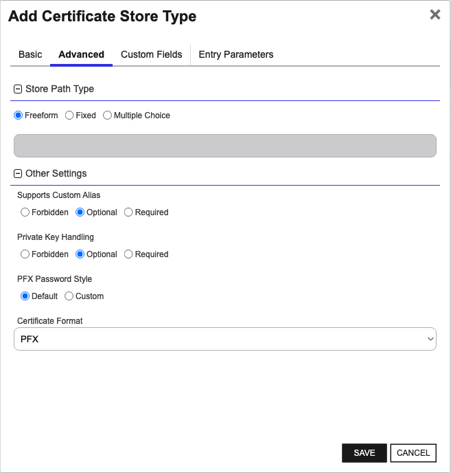
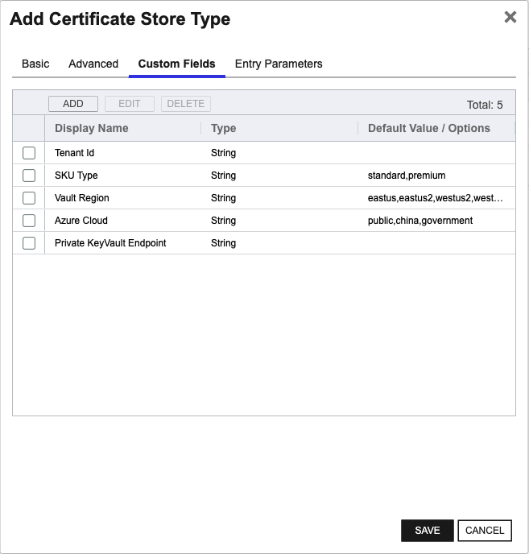
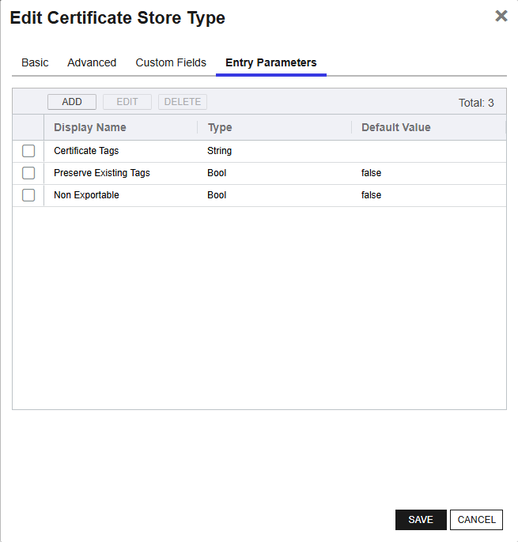

<h1 align="center" style="border-bottom: none">
    Azure Key Vault Universal Orchestrator Extension
</h1>

<p align="center">
  <!-- Badges -->

<a href="https://github.com/Keyfactor/azurekeyvault-orchestrator/releases"></a>


</p>

<p align="center">
  <!-- TOC -->
  <a href="#support">
    <b>Support</b>
  </a>
  ·
  <a href="#installation">
    <b>Installation</b>
  </a>
  ·
  <a href="#license">
    <b>License</b>
  </a>
  ·
  <a href="https://github.com/orgs/Keyfactor/repositories?q=orchestrator">
    <b>Related Integrations</b>
  </a>
</p>

## Overview

The Azure Key Vault Universal Orchestrator extension enables seamless integration between Keyfactor Command and
Microsoft Azure Key Vault. This extension facilitates remote management of cryptographic certificates stored in Azure
Key Vault, ensuring organizational security and compliance requirements are met. With this extension, users can manage
certificates remotely by performing various operations such as inventory, addition, removal, and discovery of
certificates and certificate stores.

Azure Key Vault is a cloud service that provides secure storage for secrets, including cryptographic keys and
certificates. Certificates in Azure Key Vault are utilized to secure communications and safeguard data by managing the
associated cryptographic keys and policies.

Defined Certificate Stores of the Certificate Store Type in Keyfactor Command represent the individual or grouped
certificates managed within a specific remote location, such as Azure Key Vault. Each Certificate Store is configured to
interface with an Azure Key Vault instance, allowing the orchestrator to perform the required certificate management
operations.


### AKV

The Azure Keyvault Certificate Store Type is designed to integrate with Microsoft Azure Key Vault, enabling users to
manage and automate the lifecycle of cryptographic certificates stored in Azure Key Vault through Keyfactor Command.
This Certificate Store Type represents the connection and configuration necessary to interact with specific instances of
Azure Key Vault, allowing for operations such as inventory, addition, removal, and discovery of certificates and
certificate stores.

This integration leverages Azure's robust security infrastructure, utilizing OAuth-based authentication methods
including Service Principals, User Assigned Managed Identities, and System Assigned Managed Identities. This ensures
that only authorized entities can manage the certificates stored within the Key Vault.

While this Certificate Store Type provides a powerful means of managing certificates, there are some important caveats
to consider. For example, if your instance of Azure Key Vault utilizes private or custom endpoints, or is hosted outside
of the Azure Public cloud (e.g., Government, China, Germany instances), certain functions like discovery job
functionality may not be supported. Additionally, the configuration of access control through Azure's Role Based Access
Control (RBAC) or classic Access Policies must be meticulously managed to ensure sufficient permissions for the
orchestrator to perform its tasks.

The integration does not require a specific SDK, as it interacts with Azure services directly through their APIs.
However, ensuring that the orchestrator has network access to Azure endpoints is crucial for smooth operation. Being
mindful of these caveats and limitations will help ensure successful deployment and use of the Azure Keyvault
Certificate Store Type within your organization’s security framework.

## Compatibility

This integration is compatible with Keyfactor Universal Orchestrator version 10.1 and later.

## Support
The Azure Key Vault Universal Orchestrator extension If you have a support issue, please open a support ticket by either contacting your Keyfactor representative or via the Keyfactor Support Portal at https://support.keyfactor.com. 
 
> To report a problem or suggest a new feature, use the **[Issues](../../issues)** tab. If you want to contribute actual bug fixes or proposed enhancements, use the **[Pull requests](../../pulls)** tab.

## Requirements & Prerequisites

Before installing the Azure Key Vault Universal Orchestrator extension, we recommend that you install [kfutil](https://github.com/Keyfactor/kfutil). Kfutil is a command-line tool that simplifies the process of creating store types, installing extensions, and instantiating certificate stores in Keyfactor Command.


### Azure Keyvault Requirements

#### Setup and Configuration

The high level steps required to configure the Azure Keyvault Orchestrator extension are:

1) [Migrating from the Windows Orchestrator for Azure KeyVault](#migrating-from-the-windows-orchestrator-for-azure-keyvault)

1) [Configure the Azure Keyvault for client access](#configure-the-azure-keyvault-for-client-access)

1) [Create the Store Type in Keyfactor](#create-the-store-type-in-keyfactor)

1) [Install the Extension on the Orchestrator](#install-the-extension-on-the-orchestrator)

1) [Create the Certificate Store](#create-the-certificate-store)

_Note that the certificate store type used by this Universal Orchestrator support for Azure Keyvault is not compatible
with the certificate store type used by with Windows Orchestrator version for Azure Keyvault.
If your Keyfactor instance has used the Windows Orchestrator for Azure Keyvault, a specific migration process is
required.
See [Migrating from the Windows Orchestrator for Azure KeyVault](#migrating-from-the-windows-orchestrator-for-azure-keyvault)
section below._

<details>
  <summary>
    <h4>Migrating from the Windows Orchestrator for Azure KeyVault</h4></summary>
If you were previously using the Azure Keyvault extension for the **Windows** Orchestrator, it is necessary to remove the Store Type definition as well as any Certificate stores that use the previous store type.
This is because the store type parameters have changed in order to facilitate the Discovery and Create functionality.

If you have an existing AKV store type that was created for use with the Windows Orchestrator, you will need to follow
the steps in one of the below sections in order to transfer the capability to the Universal Orchestrator.

> :warning:
> Before removing the certificate stores, view their configuration details and copy the values.
> Copying the values in the store parameters will save time when re-creating the stores.

Follow the below steps to remove the AKV capability from **each** active Windows Orchestrator that supports it:

###### If the Windows Orchestrator should still manage other cert store types

_If the Windows Orchestrator will still be used to manage some store types, we will remove only the Azure Keyvault
functionality._

1) On the Windows Orchestrator host machine, run the Keyfactor Agent Configuration Wizard
1) Proceed through the steps to "Select Features"
1) Expand "Cert Stores" and un-check "Azure Keyvault"
1) Click "Apply Configuration"

1) Open the Keyfactor Platform and navigate to **Orchestrators > Management**
1) Confirm that "AKV" no longer appears under "Capabilities"
1) Navigate to **Orchestrators > Management**, select the orchestrator and click "DISAPPROVE" to disapprove it and
   cancel pending jobs.
1) Navigate to **Locations > Certificate Stores**
1) Select any stores with the Category "Azure Keyvault" and click "DELETE" to remove them from Keyfactor.
1) Navigate to the Administrative menu (gear icon) and then **> Certificate Store Types**
1) Select Azure Keyvault, click "DELETE" and confirm.
1) Navigate to **Orchestrators > Management**, select the orchestrator and click "APPROVE" to re-approve it for use.

1) Repeat these steps for any other Windows Orchestrators that support the AKV store type.

###### If the Windows Orchestrator can be retired completely

_If the Windows Orchestrator is being completely replaced with the Universal Orchestrator, we can remove all associated
stores and jobs._

1) Navigate to **Orchestrators > Management** and select the Windows Orchestrator from the list.
1) With the orchestrator selected, click the "RESET" button at the top of the list
1) Make sure the orchestrator is still selected, and click "DISAPPROVE".
1) Click "OK" to confirm that you will remove all jobs and certificate stores associated to this orchestrator.
1) Navigate to the the Administrative (gear icon in the top right) and then **Certificate Store Types**
1) Select "Azure Keyvault", click "DELETE" and confirm.
1) Repeat these steps for any other Windows Orchestrators that support the AKV store type (if they can also be retired).

Note: Any Azure Keyvault certificate stores removed can be re-added once the Universal Orchestrator is configured with
the AKV capability.

##### Migrating from  version 1.x or version 2.x of the Azure Keyvault Orchestrator Extension

It is not necessary to re-create all of the certificate stores when migrating from a previous version of this extension,
though it is important to note that Azure KeyVaults found during a Discovery job
will return with latest store path format: `{subscription id}:{resource group name}:{new vault name}`.

</details>

---

##### Configure the Azure Keyvault for client access

In order for this orchestrator extension to be able to interact with your instances of Azure Keyvault, it will need to
authenticate with a identity that has sufficient permissions to perform the jobs. Microsoft Azure implements both Role
Based Access Control (RBAC) and the classic Access Policy method. RBAC is the preferred method, as it allows the
assignment of granular level, inheretable access control on both the contents of the KeyVaults, as well as higher-level
management operations. For more information and a comparison of the two access control strategies, refer
to [this article](learn.microsoft.com/en-us/azure/key-vault/general/rbac-access-policy).

###### RBAC vs Access Policies

Azure KeyVaults originally utilized access policies for permissions and since then, Microsoft has begun recommending
Role Based Access Control (RBAC) as the preferred method of authorization.  
As of this version, new KeyVaults created via this integration are created with Access Policy authorization. This will
change to RBAC in the next release.
The access control type the KeyVault implements can be changed in the KeyVault configuration within the Azure Portal.
New KeyVaults created via Keyfactor by way of this integration will be accessible for subsequent actions regardless of
the access control type.

###### Configure Role Based Access Control (RBAC)

In order to illustrate the minimum permissions that the authenticating entity (service principal or managed identity)
requires,
we have created 3 seperate custom role definitions that you can use as a reference when creating an RBAC role definition
in your Azure environment.

The reason for 3 definitions is that certain orchestrator jobs, such as Create (new KeyVault) or Discovery require more
elevated permissions at a different scope than the basic certificate operations (Inventory, Add, Remove) performed
within a specific KeyVault.

If you know that you will utilize all of the capabilities of this integration; the last custom role definition contains
all necessary permissions for performing all of the Jobs (Discovery, Create KeyVault, Inventory/Add/Remove
certificates).

###### Built-in vs. custom roles

> :warning: The custom role definitions below are designed to contain the absolute minimum permissions required. They
> are not intended to be used verbatim without consulting your organization's security team and/or Azure Administrator.
> Keyfactor does not provide consulting on internal security practices.

It is possible to use the built-in roles provided by Microsoft for these operations. The built-in roles may contain more
permissions than necessary.
Whether to create custom role definitions or use an existing or pre-built role will depend on your organization's
securuity requirements.  
For each job type performed by this orchestrator, we've included the minimally sufficient built-in role name(s) along
with our custom role definitions that limit permissions to the specific actions and scopes necessary.

<details>
  <summary><h4>Create Vault permissions</h4></summary>

In order to allow for the ability to create new Azure KeyVaults from within command, here is a role that defines the
necessary permissions to do so. If you will never be creating new Azure KeyVaults from within Command, then it is
unnecessary to provide the authenticating entity with these permissions.

> :warning: When creating a new KeyVault, we grant the creating entity the built-in "Key Vault Certificates Officer"
> role in order to be able to perform subsequent actions on the contents of the
> KeyVault. [click here](github.com/MicrosoftDocs/azure-docs/blob/main/articles/role-based-access-control/built-in-roles/security.md#key-vault-certificates-officer)
> to see the list of permissions included in the Key Vault Certificates Officer built-in role.

- built-in roles (both are required):
    - ["Key Vault Contributor"](https://learn.microsoft.com/en-us/azure/role-based-access-control/built-in-roles/security#key-vault-contributor)
    - ["Key Vault Access Administrator"](https://learn.microsoft.com/en-us/azure/role-based-access-control/built-in-roles/security#key-vault-data-access-administrator)

- lowest level scope required - a resource group that will contain the new KeyVault.

- condition:

```js
"((!(ActionMatches{'Microsoft.Authorization/roleAssignments/write'})) OR (@Request[Microsoft.Authorization/roleAssignments:RoleDefinitionId] ForAnyOfAnyValues:GuidEquals{a4417e6f-fecd-4de8-b567-7b0420556985})) AND ((!(ActionMatches{'Microsoft.Authorization/roleAssignments/delete'})) OR (@Resource[Microsoft.Authorization/roleAssignments:RoleDefinitionId] ForAnyOfAnyValues:GuidEquals{a4417e6f-fecd-4de8-b567-7b0420556985}))"
```

the above condition limits the ability to assign roles to a single role only (Key Vault Certificates Officer). This is
more restrictive than the condition on the built-in role
of [Key Vault Access Administrator](https://learn.microsoft.com/en-us/azure/role-based-access-control/built-in-roles/security#key-vault-data-access-administrator).

- custom role definition:

```js
{
    "properties": {
        "roleName": "KeyfactorVaultCreator",
        "description": "This role contains all of the necessary permissions to perform Inventory, Add and Remove operations on certificates on All KeyVaults within a Resource Group.  It also contains sufficient permissions to create a new KeyVault within the resource group.",
        "assignableScopes": [
          "/subscriptions/{subscriptionId1}", // allow to be applied to a specific subscription
          "/subscriptions/{subscriptionId2}", // and another.. etc.
          "/subscriptions/{subscriptionId}/resourcegroups/{resourceGroupName}", // allow to be scoped to a specific resource group
          "/subscriptions/{subscriptionId2}/resourcegroups/{resourceGroupName2}", // and another.. 
          "/providers/Microsoft.Management/managementGroups/{groupId1}" // allow to be applied for all subscriptions under management group           
        ],
        "permissions": [
            {
                "actions": [
                    "Microsoft.KeyVault/vaults/*",
                    "Microsoft.Authorization/*/read",                                        
                    "Microsoft.KeyVault/register/action",                    
                    "Microsoft.KeyVault/checkNameAvailability/read",
                    "Microsoft.KeyVault/vaults/accessPolicies/*",
                    "Microsoft.Resources/deployments/*",
                    "Microsoft.KeyVault/locations/*/read",
                    "Microsoft.Resources/subscriptions/resourceGroups/read",
                    "Microsoft.Management/managementGroups/read",
                    "Microsoft.Resources/subscriptions/read",
                    "Microsoft.Authorization/roleAssignments/*",                     
                    "Microsoft.KeyVault/operations/read"                    
                ],
                "notActions": [],
                "dataActions": [],
                "notDataActions": [],
                "conditionVersion": "2.0",
                "condition": "((!(ActionMatches{'Microsoft.Authorization/roleAssignments/write'})) OR (@Request[Microsoft.Authorization/roleAssignments:RoleDefinitionId] ForAnyOfAnyValues:GuidEquals{a4417e6f-fecd-4de8-b567-7b0420556985})) AND ((!(ActionMatches{'Microsoft.Authorization/roleAssignments/delete'})) OR (@Resource[Microsoft.Authorization/roleAssignments:RoleDefinitionId] ForAnyOfAnyValues:GuidEquals{a4417e6f-fecd-4de8-b567-7b0420556985}))"
            }
        ]
    }
}
```

</details>
<details>
  <summary><h4>Discover Vaults Permissions</h4></summary>

If you would like this integration to search across your subscriptions to discover instances of existing Azure
KeyVaults, this role definition contains the necessary permissions for this.
If you are working with a smaller number of KeyVaults and/or do not plan on utilizing a Discovery job to retrieve all
KeyVaults across your subscriptions, the permissions defined in this role are not necessary.

- built-in
  role: ["Key Vault Reader"](github.com/MicrosoftDocs/azure-docs/blob/main/articles/role-based-access-control/built-in-roles/security.md#key-vault-reader)
- lowest level scope - a resource group
- custom role definition:

```js
{
    "properties": {
        "roleName": "KeyfactorVaultDiscovery",
        "description": "This role contains all of the necessary permissions to search for KeyVaults across a subscription",
        "assignableScopes": [
          "/subscriptions/{subscriptionId1}", // allow to be applied to a specific subscription
          "/subscriptions/{subscriptionId2}", // and another.. etc.
          "/subscriptions/{subscriptionId}/resourcegroups/{resourceGroupName}", // allow to be scoped to a specific resource group
          "/subscriptions/{subscriptionId2}/resourcegroups/{resourceGroupName2}", // and another.. 
          "/providers/Microsoft.Management/managementGroups/{groupId1}" // allow to be applied for all resources under management group           
        ],
        "permissions": [
            {
              "actions": [
                "Microsoft.Authorization/*/read",
                "Microsoft.Resources/subscriptions/resourceGroups/read",
                "Microsoft.KeyVault/checkNameAvailability/read",
                "Microsoft.KeyVault/locations/*/read",
                "Microsoft.KeyVault/vaults/read",
                "Microsoft.KeyVault/operations/read"
               ],
               "notActions": [],
               "dataActions": [        
               ],
               "notDataActions": [],  
             }
          ]
    }
}
```

</details>
<details>
  <summary><h4>Inventory, Add, and Remove Certificate Permissions</h4></summary>

This set of permissions is the minimum required to support the basic operations of performing an Inventory and
Add/Removal of certificates.

- built-in
  role: ["Key Vault Certificates Officer"](github.com/MicrosoftDocs/azure-docs/blob/main/articles/role-based-access-control/built-in-roles/security.md#key-vault-certificates-officer)
- lowest level scope - an individual keyvault
- custom role definition:

```js
{
    "properties": {
        "roleName": "KeyfactorManageCerts",
        "description": "This role contains all of the necessary permissions to perform Inventory, Add and Remove operations on certificates on All KeyVaults within the scope.",
        "assignableScopes": [
          "/providers/Microsoft.Management/managementGroups/{groupId1}", // allow scope for all subscriptions under management group
          "/subscriptions/{subscriptionId}", // allow to scoped to a specific subscription
          "/subscriptions/{subscriptionId2}", // and another.. etc.
          "/subscriptions/{subscriptionId}/resourcegroups/{resourceGroupName}", // allow to be scoped to a specific resource group
          "/subscriptions/{subscriptionId2}/resourcegroups/{resourceGroupName2}", // and another..               
          "/subscriptions/{subscriptionId}/resourceGroups/{resourceGroupName}/providers/Microsoft.KeyVault/vaults/{vaultName}", // allow scope to a specific vault
          "/subscriptions/{subscriptionId2}/resourceGroups/{resourceGroupName2}/providers/Microsoft.KeyVault/vaults/{vaultName2}", // .. and another
        ],
         "permissions": [
           {
             "actions": [
               "Microsoft.Authorization/*/read",
               "Microsoft.Resources/deployments/*",
               "Microsoft.Resources/subscriptions/resourceGroups/read",
               "Microsoft.KeyVault/checkNameAvailability/read",
               "Microsoft.KeyVault/locations/*/read",
               "Microsoft.KeyVault/vaults/*/read",
               "Microsoft.KeyVault/operations/read",               
             ],
             "notActions": [],
             "dataActions": [
               "Microsoft.KeyVault/vaults/certificates/*",
               "Microsoft.KeyVault/vaults/certificatecas/*",
               "Microsoft.KeyVault/vaults/keys/*",
               "Microsoft.KeyVault/vaults/secrets/readMetadata/action"
             ],
             "notDataActions": []
           }
    ],
  }
}
```

</details>

<details>
  <summary><h4>Combined permissions for all operations (Create, Discovery, Inventory, Add and Remove certificates)</h4></summary>

This section defines a single custom role that contains the necessary permissions to perform all operations allowed by
this integration. The minimum scope allowable is an individual resource group. If this custom role is associated with
the authenticating identity, it will be able to discover existing KeyVaults, Create new ones, and perform inventory as
well as adding and removing certificates within the KeyVault.

- minimally sufficient built-in roles (all are required):
    - ["Key Vault Certificates Officer"](github.com/MicrosoftDocs/azure-docs/blob/main/articles/role-based-access-control/built-in-roles/security.md#key-vault-certificates-officer)
    - ["Key Vault Contributor"](learn.microsoft.com/en-us/azure/role-based-access-control/built-in-roles/security#key-vault-contributor)
    - ["Key Vault Access Administrator"](learn.microsoft.com/en-us/azure/role-based-access-control/built-in-roles/)
- lowest level scope - an individual resource group
- custom role definition:

```js
{
    "properties": {
        "roleName": "KeyfactorKeyVaultOperations",
        "description": "This role contains all of the necessary permissions to perform Discovery, Create, Inventory, Add and Remove operations on certificates on All KeyVaults within The scope.",
        "assignableScopes": [
          "/subscriptions/{subscriptionId1}", // allow to be applied to a specific subscription
          "/subscriptions/{subscriptionId2}", // and another.. etc.
          "/subscriptions/{subscriptionId}/resourcegroups/{resourceGroupName}", // allow to be scoped to a specific resource group
          "/subscriptions/{subscriptionId2}/resourcegroups/{resourceGroupName2}", // and another.. 
          "/providers/Microsoft.Management/managementGroups/{groupId1}" // allow to be applied for all subscriptions under management group           
        ],
        "permissions": [
            {
                "actions": [
                    "Microsoft.KeyVault/vaults/*",
                    "Microsoft.Authorization/*/read",                                        
                    "Microsoft.KeyVault/register/action",                    
                    "Microsoft.KeyVault/checkNameAvailability/read",
                    "Microsoft.KeyVault/vaults/accessPolicies/*",
                    "Microsoft.Resources/deployments/*",
                    "Microsoft.Resources/subscriptions/resourceGroups/read",
                    "Microsoft.Management/managementGroups/read",
                    "Microsoft.Resources/subscriptions/read",
                    "Microsoft.Authorization/roleAssignments/*",                     
                    "Microsoft.KeyVault/operations/read"                                
                    "Microsoft.KeyVault/locations/*/read",
                    "Microsoft.KeyVault/vaults/*/read",
                ],
                "notActions": [],
                "dataActions": [
                   "Microsoft.KeyVault/vaults/certificates/*",
                   "Microsoft.KeyVault/vaults/certificatecas/*",
                   "Microsoft.KeyVault/vaults/keys/*",
                   "Microsoft.KeyVault/vaults/secrets/*"
             ],
                "notDataActions": [],
                "conditionVersion": "2.0",
                "condition": "((!(ActionMatches{'Microsoft.Authorization/roleAssignments/write'})) OR (@Request[Microsoft.Authorization/roleAssignments:RoleDefinitionId] ForAnyOfAnyValues:GuidEquals{a4417e6f-fecd-4de8-b567-7b0420556985})) AND ((!(ActionMatches{'Microsoft.Authorization/roleAssignments/delete'})) OR (@Resource[Microsoft.Authorization/roleAssignments:RoleDefinitionId] ForAnyOfAnyValues:GuidEquals{a4417e6f-fecd-4de8-b567-7b0420556985}))"
            }
        ]
    }
}
```

> :warning: You still may decide to split the capabilities into seperate roles in order to apply each of them to the
> lowest level scope
> required. We have tried to provide you with an absolute minimum set of required permissions necessary to perform each
> operation. Refer to
> your organization's security policies and/or consult with your information security team in order to determine which
> role combinations would
> be most appropriate for your needs.

</details>

##### Endpoint Access / Firewall

At a minimum, the orchestrator needs access to the following URLs:

- The instance of Keyfactor Command
- 'login.microsoftonline.com' (or the endpoint corresponding to the Azure Global Cloud instance (Government, China,
  Germany).
    - this is only technically necessary if they are using Service Principal authentication.
- 'management.azure.com' for all management operations (Create, Add, Remove) as well as Discovery.
    - This is necessary for authenticating the ARM client used to perform these operations.

Any firewall applied to the orchestrator host will need to be configured to allow access to these endpoints in order for
this integration to make the necessary API requests.

> :warning: Discovery jobs are not supported for KeyVaults located outside of the Azure Public cloud or Keyvaults
> accessed via a private url endpoint.  
> All other job types implemented by this integration are supported for alternate Azure clouds and private endpoints.

##### Authentication options

The Azure KeyVault orchestrator plugin supports several authentication options:

- [Service Principal](#authentication-via-service-principal)
- [User Assigned Managed Identities](#authentication-via-user-assigned-managed-identity)
- [System Assigned Managed Identities](#authentication-via-system-assigned-managed-identity)

Steps for setting up each option are detailed below.

<details>
  <summary><h4>Authentication via Service Principal</h4></summary>

For the Orchestrator to be able to interact with the instance of Azure Keyvault, we will need to create an entity in
Azure that will encapsulate the permissions we would like to grant it. In Azure, these intermediate entities are
referred to as app registrations and they provision authority for external application access.
To learn more about application and service principals, refer
to [this article](https://docs.microsoft.com/en-us/azure/active-directory/develop/howto-create-service-principal-portal).

To provision access to the Keyvault instance using a service principal identity, we will:

1) [Create a Service Principal in Azure Active Directory](#create-a-service-principal)

1) [Assign it sufficient permissions for Keyvault operations](#assign-permissions)

1) [Generate an Access Token for Authenticating](#generate-an-access-token)

1) [Store the server credentials in Keyfactor](#store-the-server-credentials-in-keyfactor)

**In order to complete these steps, you must have the _Owner_ role for the Azure subscription, at least temporarily.**
This is required to create an App Registration in Azure Active Directory.

##### Create A Service Principal

**Note:** In order to manage key vaults in multiple Azure tenants using a single service principal, the supported
account types option selected should be:
`Accounts in any organizational directory (Any Azure AD directory - Multitenant)`. Also, the app registration must be
registered in a single tenant, but a service principal must be created in each tenant tied to the app registration. For
more info review
the [Microsoft documentation](https://learn.microsoft.com/en-us/azure/active-directory/fundamentals/service-accounts-principal#tenant-service-principal-relationships).

For detailed instructions on how to create a service principal in Azure, [see here](create_sp_azure.md).

Once we have our App registration created in Azure, record the following values

- _TenantId_
- _ApplicationId_
- _ClientSecret_

We will store these values securely in Keyfactor in subsequent steps.

</details>

<details>
  <summary><h4>Authentication via User Assigned Managed Identity</h4></summary>

Authentication has been somewhat simplified with the introduction of Azure Managed Identities. If the orchestrator is
running on an Azure Virtual Machine, Managed identities allow an Azure administrator to
assign a managed identity to the virtual machine that can then be used by this orchestrator extension for authentication
without the need to issue or manage client secrets.

The two types of managed identities available in Azure are _System_ assigned, and _User_ assigned identities.

- System assigned managed identities are bound to the specific resource and not reassignable. They are bound to the
  resource and share the same lifecycle.
- User assigned managed identities exist as a standalone entity, independent of a resource, and can therefore be
  assigned to multiple Azure resources.

Read more about Azure Managed
Identities [here](https://learn.microsoft.com/en-us/azure/active-directory/managed-identities-azure-resources/overview).

Detailed steps for creating a managed identity and assigning permissions can be
found [here](https://learn.microsoft.com/en-us/azure/active-directory/managed-identities-azure-resources/how-manage-user-assigned-managed-identities?pivots=identity-mi-methods-azp).

Once the User Assigned managed identity has been created, you will need only to enter the Client Id into the Application
Id field on the certificate store definition (the Client Secret can be left blank).

</details>

<details>
<summary><h4>Authentication via System Assigned Managed Identity</h4></summary>

In order to use a _System_ assigned managed identity, there is no need to enter the server credentials. If no server
credentials are provided, the extension assumes authentication is via system assigned managed identity.

</details>

##### Create the Store Type in Keyfactor

Now we can navigate to the Keyfactor platform and create the store type for Azure Key Vault.

1) Navigate to your instance of Keyfactor and log in with a user that has Administrator privileges.

1) Click on the gear icon in the top left and navigate to "Certificate Store Types".

   

1) Click "Add" to open the Add Certificate Store dialog.

1) Name the new store type "Azure Keyvault" and give it the short name of "AKV".

1) The Azure Keyvault integration supports the following job types: _Inventory, Add, Remove, Create and Discovery_.
   Select from these the capabilities you would like to utilize.

> :warning: The store type definition needs to include the necessary fields to support Create functionality (SkuType and
> VaultRegion). Be sure to read through the _Custom Fields_ instructions below and set them up with the required fields if
> Creating new Azure Keyvaults from Keyfactor Command is desired.

1) **If you are using a Service Principal or User assigned Managed Identity only** Make sure that "Needs Server" is
   checked.

   

> :warning:
> if you are using a system assigned managed identity for authentication, you should leave this unchecked.

1) Navigate to the _Advanced_ tab and set the following values:
    - Store Path Type: **Freeform**
    - Supports Custom Alias: **Optional**
    - Private Key Handling: **Optional**
    - PFX Password Style: **Default**

   

1) Navigate to the _Custom Fields_ tab and add the custom fields for the store type.

> :warning: If you are using the Global Public cloud (*.vault.azure.net) and creating new Azure
> Keyvaults from Keyfactor Command functionality is not necessary for your workflow, this section can
> be skipped entirely.

- The below two fields are necessary if working with Keyvaults in Azure Cloud instances that are not the standard global
  public one (*.vault.azure.net)  If your vault instance(s) have the base url of `.vault.azure.net` then the next two
  fields can be omitted from the store type definition and the default global public cloud will be assumed.
-
    - The "Azure Cloud" field refers to

| Name                              | Display Name     | Type           | Required |
|-----------------------------------|------------------|----------------|----------|
| AzureCloud[^azurecloud]           | Azure Cloud      | MultipleChoice | false    |
| PrivateEndpoint[^privateEndpoint] | Private Endpoint | String         | false    |

[^azurecloud]: The Azure Cloud field, if necessary, should contain one of the following values: "china, germany,
government". This is the Azure Cloud instance your organization uses. If using the standard "public" cloud, this field
can be left blank or omitted entirely from the store type definition.

[^privateEndpoint]: The Private Endpoint field should be used if you if have a custom url assigned to your keyvault
resources and they are not accessible via the standard endpoint associated with the Azure Cloud instance (*
.vault.azure.net, *.vault.azure.cn, etc.). This field should contain the base url for your vault instance(s), excluding
the vault name.

- The following fields are _only_ necessary in order to support creating new Azure Keyvaults from the Keyfactor Command
  platform. If this functionality is not needed, there is no need to set up these fields.

| Name                      | Display Name | Type           | Required |
|---------------------------|--------------|----------------|----------|
| TenantId                  | Tenant Id    | String         | false    | 
| SkuType[^sku]             | SKU Type     | MultipleChoice | false    |
| VaultRegion[^vaultregion] | Vault Region | MultipleChoice | false    |

[^sku]: The SkuType determines the service tier when creating a new instance of Azure KeyVault via the platform. Valid
values include "premium" and "standard".
If either option should be available when creating a new KeyVault from the Command platform via creating a new
certificate store, then the value to enter for the multiple choice options should be "standard,premium".
If your organization requires that one or the other option should always be used, you can limit the options to a single
value ("premium" or "standard"). If not selected, "standard" is used when creating a new KeyVault.

[^vaultregion]: The Vault Region field is only important when creating a new Azure KeyVault from the Command Platform.
This is the region that the newly created vault will be created in. When creating the cert store type,
you can limit the options to those that should be applicable to your organization. Refer to
the [Azure Documentation](https://learn.microsoft.com/en-us/dotnet/api/azure.core.azurelocation?view=azure-dotnethttps://learn.microsoft.com/en-us/dotnet/api/azure.core.azurelocation?view=azure-dotnet)
for a list of valid region names.
If no value is selected, "eastus" is used by default.

##### Install the Extension on the Orchestrator

The process for installing an extension for the universal orchestrator differs from the process of installing an
extension for the Windows orchestrator. Follow the below steps to register the Azure Keyvault integration with your
instance of the universal orchestrator.

1) Stop the Universal Orchestrator service.

    1) Note: In Windows, this service is called "Keyfactor Orchestrator Service (Default)"

1) Create a folder in the "extensions" folder of the Universal Orchestrator installation folder named "AKV" (the name is
   not important)

    1) example: `C:\Program Files\Keyfactor\Keyfactor Orchestrator\extensions\_AKV_

1) Copy the build output (if you compiled from source) or the contents of the zip file (if you downloaded the
   pre-compiled binaries) into this folder.

1) Start the Universal Orchestrator Service

##### Discover Certificate Stores

Now that we have the extension registered on the Orchestrator, we can navigate back to the Keyfactor platform and finish
the setup. If there are existing Azure Key Vaults, complete the below steps to discover and add them. If there are no
existing key vaults to integrate and you will be creating a new one via the Keyfactor Platform, you can skip to the next
section.

1) Navigate to Orchestrators > Management in the platform.

   

1) Find the row corresponding to the orchestrator that we just installed the extension on.

1) If the store type has been created and the integration installed on the orchestrator, you should see the _AKV_
   capability in the list.

   

1) Approve the orchestrator if necessary.

###### Create the discovery job

1) Navigate to "Locations > Certificate Stores"

   

1) Click the "Discover" tab, and then the "Schedule" button.

   

1) You should see the form for creating the Discovery job.

   

###### Store the Server Credentials in Keyfactor

> :warning:
> The steps for configuring discovery are different for each authentication type.

- For System Assigned managed identity authentication this step can be skipped. No server credentials are necessary. The
  store type should have been set up without "needs server" checked, so the form field should not be present.

- For User assigned managed identity:
    - `Client Machine` should be set to the GUID of the tenant ID of the instance of Azure Keyvault.
    - `User` should be set to the Client ID of the managed identity.
    - `Password` should be set to the value **"managed"**.

- For Service principal authentication:
    - `Client Machine` should be set to the GUID of the tenant ID of the instance of Azure Keyvault. **Note:** If using
      a multi-tenant app registration, use the tenant ID of the Azure tenant where the key vault lives.
    - `User` should be set to the service principal id
    - `Password` should be set to the client secret.

The first thing we'll need to do is store the server credentials that will be used by the extension.
The combination of fields required to interact with the Azure Keyvault are:

- Tenant (or Directory) ID
- Application ID or user managed identity ID
- Client Secret (if using Service Principal Authentication)

If not using system managed identity authentication, the integration expects the above values to be included in the
server credentials in the following way:

- **Client Machine**: `<tenantId>` (GUID)

- **User**: `<app id guid>` (if service principal authentication) `<managed user id>` (if user managed identity
  authentication is used)

- **Password**: `<client secret>` (if service principal authentication), `managed` (if user managed identity
  authentication is used)

Follow these steps to store the values:

1) Enter the _Tenant Id_ in the **Client Machine** field.

   

1) Click "Change Credentials" to open up the Server Credentials form.

   

1) Click "UPDATE SERVER USERNAME" and Enter the appropriate values based on the authentication type.

   

1) Enter again to confirm, and click save.

1) Click "UPDATE SERVER PASSWORD" and update with the appropriate value (`<client secret>` or `managed`) following the
   same steps as above.

1) Select a time to run the discovery job.

1) Enter commma seperated list of tenant ID's in the "Directories to search" field.'

> :warning:
> If nothing is entered here, the default Tenant ID included with the credentials will be used. For system managed
> identities, it is necessary to include the Tenant ID(s) in this field.

1) Leave the remaining fields blank and click "SAVE".

###### Approve the Certificate Store

When the Discovery job runs successfully, it will list the existing Azure Keyvaults that are acessible by our service
principal.

In this example, our job returned these Azure Keyvaults.


The store path of each vault is the `<subscription id>:<resource group name>:<vault name>`:


To add one of these results to Keyfactor as a certificate store:

1) Double-click the row that corresponds to the Azure Keyvault in the discovery results (you can also select the row and
   click "SAVE").

1) In the dialog window, enter values for any of the optional fields you have set up for your store type.

1) Select a container to store the certificates for this cert store (optional)

1) Select any value for SKU Type and Vault Region. These values are not used for existing KeyVaults.

1) Click "SAVE".

##### Add a new or existing Azure Keyvault certificate store

You can also add a certificate store that corresponds to an Azure Keyvault individually without the need to run the
discovery / approval workflow.
The steps to do this are:

1) Navigate to "Locations > Certificate Stores"

1) Click "ADD"

   

1) Enter the values corresponding to the Azure Keyvault instance.

- **Category**: Azure Keyvault
- **Container**: _optional_
- **Client Machine**: If applicable; Tenant Id.

    - Note: These will only have to be entered once, even if adding multiple certificate stores.
    - Follow the steps [here](#store-the-server-credentials-in-keyfactor) to enter them.

- **Store Path**: This is the Subscription ID, Resource Group name, and Vault name in the following format:
  `{subscription id}:{resource group name}:{new vault name}`

- **SKU Type**: This field is only used when creating new vaults in Azure. If present, select any value, or leave blank.
- **Vault Region**: This field is also only used when creating new vaults. If present, select any value.

If the vault already exists in azure the store path can be found by navigating to the existing Keyvault resource in
Azure and clicking "Properties" in the left menu.


- Use these values to create the store path

If the Keyvault does not exist in Azure, and you would like to create it:

- Enter a value for the store path in the following format: `{subscription id}:{resource group name}:{new vault name}`

- For a non-existing Keyvault that you would like to create in Azure, make sure you have the "Create Certificate Store"
  box checked.

> :warning: The identity you are using for authentication will need to have sufficient Azure permissions to be able to
> create new Keyvaults.

---

##### License

[Apache](https://apache.org/licenses/LICENSE-2.0)


## Create the AKV Certificate Store Type

To use the Azure Key Vault Universal Orchestrator extension, you **must** create the AKV Certificate Store Type. This only needs to happen _once_ per Keyfactor Command instance.


* **Create AKV using kfutil**:

    ```shell
    # Azure Keyvault
    kfutil store-types create AKV
    ```

* **Create AKV manually in the Command UI**:
    <details><summary>Create AKV manually in the Command UI</summary>

    Create a store type called `AKV` with the attributes in the tables below:

    #### Basic Tab
    | Attribute | Value | Description |
    | --------- | ----- | ----- |
    | Name | Azure Keyvault | Display name for the store type (may be customized) |
    | Short Name | AKV | Short display name for the store type |
    | Capability | AKV | Store type name orchestrator will register with. Check the box to allow entry of value |
    | Supports Add | ✅ Checked | Check the box. Indicates that the Store Type supports Management Add |
    | Supports Remove | ✅ Checked | Check the box. Indicates that the Store Type supports Management Remove |
    | Supports Discovery | ✅ Checked | Check the box. Indicates that the Store Type supports Discovery |
    | Supports Reenrollment | 🔲 Unchecked |  Indicates that the Store Type supports Reenrollment |
    | Supports Create | ✅ Checked | Check the box. Indicates that the Store Type supports store creation |
    | Needs Server | ✅ Checked | Determines if a target server name is required when creating store |
    | Blueprint Allowed | 🔲 Unchecked | Determines if store type may be included in an Orchestrator blueprint |
    | Uses PowerShell | 🔲 Unchecked | Determines if underlying implementation is PowerShell |
    | Requires Store Password | 🔲 Unchecked | Enables users to optionally specify a store password when defining a Certificate Store. |
    | Supports Entry Password | 🔲 Unchecked | Determines if an individual entry within a store can have a password. |

    The Basic tab should look like this:

    

    #### Advanced Tab
    | Attribute | Value | Description |
    | --------- | ----- | ----- |
    | Supports Custom Alias | Optional | Determines if an individual entry within a store can have a custom Alias. |
    | Private Key Handling | Optional | This determines if Keyfactor can send the private key associated with a certificate to the store. Required because IIS certificates without private keys would be invalid. |
    | PFX Password Style | Default | 'Default' - PFX password is randomly generated, 'Custom' - PFX password may be specified when the enrollment job is created (Requires the Allow Custom Password application setting to be enabled.) |

    The Advanced tab should look like this:

    

    > For Keyfactor **Command versions 24.4 and later**, a Certificate Format dropdown is available with PFX and PEM options. Ensure that **PFX** is selected, as this determines the format of new and renewed certificates sent to the Orchestrator during a Management job. Currently, all Keyfactor-supported Orchestrator extensions support only PFX.

    #### Custom Fields Tab
    Custom fields operate at the certificate store level and are used to control how the orchestrator connects to the remote target server containing the certificate store to be managed. The following custom fields should be added to the store type:

    | Name | Display Name | Description | Type | Default Value/Options | Required |
    | ---- | ------------ | ---- | --------------------- | -------- | ----------- |
    | TenantId | Tenant Id | The ID of the primary Azure Tenant where the KeyVaults are hosted | String |  | 🔲 Unchecked |
    | SkuType | SKU Type | The SKU type for newly created KeyVaults (only needed if needing to create new KeyVaults in your Azure subscription via Command) | MultipleChoice | standard,premium | 🔲 Unchecked |
    | VaultRegion | Vault Region | The Azure Region to put newly created KeyVaults (only needed if needing to create new KeyVaults in your Azure subscription via Command) | MultipleChoice | eastus,eastus2,westus2,westus3,westus | 🔲 Unchecked |
    | AzureCloud | Azure Cloud | The Azure Cloud where the KeyVaults are located (only necessary if not using the standard Azure Public cloud) | MultipleChoice | public,china,government | 🔲 Unchecked |
    | PrivateEndpoint | Private KeyVault Endpoint | The private endpoint of your vault instance (if a private endpoint is configured in Azure) | String |  | 🔲 Unchecked |

    The Custom Fields tab should look like this:

    


    #### Entry Parameters Tab

    | Name | Display Name | Description | Type | Default Value | Entry has a private key | Adding an entry | Removing an entry | Reenrolling an entry |
    | ---- | ------------ | ---- | ------------- | ----------------------- | ---------------- | ----------------- | ------------------- | ----------- |
    | CertificateTags | Certificate Tags | If desired, tags can be applied to the KeyVault entries.  Provide them as a JSON string of key-value pairs ie: '{'tag-name': 'tag-content', 'other-tag-name': 'other-tag-content'}' | string |  | 🔲 Unchecked | 🔲 Unchecked | 🔲 Unchecked | 🔲 Unchecked |

    The Entry Parameters tab should look like this:

    


    </details>

## Installation

1. **Download the latest Azure Key Vault Universal Orchestrator extension from GitHub.** 

    Navigate to the [Azure Key Vault Universal Orchestrator extension GitHub version page](https://github.com/Keyfactor/azurekeyvault-orchestrator/releases/latest). Refer to the compatibility matrix below to determine whether the `net6.0` or `net8.0` asset should be downloaded. Then, click the corresponding asset to download the zip archive.
    | Universal Orchestrator Version | Latest .NET version installed on the Universal Orchestrator server | `rollForward` condition in `Orchestrator.runtimeconfig.json` | `azurekeyvault-orchestrator` .NET version to download |
    | --------- | ----------- | ----------- | ----------- |
    | Older than `11.0.0` | | | `net6.0` |
    | Between `11.0.0` and `11.5.1` (inclusive) | `net6.0` | | `net6.0` | 
    | Between `11.0.0` and `11.5.1` (inclusive) | `net8.0` | `Disable` | `net6.0` | 
    | Between `11.0.0` and `11.5.1` (inclusive) | `net8.0` | `LatestMajor` | `net8.0` | 
    | `11.6` _and_ newer | `net8.0` | | `net8.0` |

    Unzip the archive containing extension assemblies to a known location.

    > **Note** If you don't see an asset with a corresponding .NET version, you should always assume that it was compiled for `net6.0`.

2. **Locate the Universal Orchestrator extensions directory.**

    * **Default on Windows** - `C:\Program Files\Keyfactor\Keyfactor Orchestrator\extensions`
    * **Default on Linux** - `/opt/keyfactor/orchestrator/extensions`
    
3. **Create a new directory for the Azure Key Vault Universal Orchestrator extension inside the extensions directory.**
        
    Create a new directory called `azurekeyvault-orchestrator`.
    > The directory name does not need to match any names used elsewhere; it just has to be unique within the extensions directory.

4. **Copy the contents of the downloaded and unzipped assemblies from __step 2__ to the `azurekeyvault-orchestrator` directory.**

5. **Restart the Universal Orchestrator service.**

    Refer to [Starting/Restarting the Universal Orchestrator service](https://software.keyfactor.com/Core-OnPrem/Current/Content/InstallingAgents/NetCoreOrchestrator/StarttheService.htm).


> The above installation steps can be supplimented by the [official Command documentation](https://software.keyfactor.com/Core-OnPrem/Current/Content/InstallingAgents/NetCoreOrchestrator/CustomExtensions.htm?Highlight=extensions).


## Defining Certificate Stores


* **Manually with the Command UI**

    <details><summary>Create Certificate Stores manually in the UI</summary>

    1. **Navigate to the _Certificate Stores_ page in Keyfactor Command.**

        Log into Keyfactor Command, toggle the _Locations_ dropdown, and click _Certificate Stores_.

    2. **Add a Certificate Store.**

        Click the Add button to add a new Certificate Store. Use the table below to populate the **Attributes** in the **Add** form.
        | Attribute | Description |
        | --------- | ----------- |
        | Category | Select "Azure Keyvault" or the customized certificate store name from the previous step. |
        | Container | Optional container to associate certificate store with. |
        | Client Machine | The GUID of the tenant ID of the Azure Keyvault instance; for example, '12345678-1234-1234-1234-123456789abc'. |
        | Store Path | A string formatted as '{subscription id}:{resource group name}:{vault name}'; for example, '12345678-1234-1234-1234-123456789abc:myResourceGroup:myVault'. |
        | Orchestrator | Select an approved orchestrator capable of managing `AKV` certificates. Specifically, one with the `AKV` capability. |
        | TenantId | The ID of the primary Azure Tenant where the KeyVaults are hosted |
        | SkuType | The SKU type for newly created KeyVaults (only needed if needing to create new KeyVaults in your Azure subscription via Command) |
        | VaultRegion | The Azure Region to put newly created KeyVaults (only needed if needing to create new KeyVaults in your Azure subscription via Command) |
        | AzureCloud | The Azure Cloud where the KeyVaults are located (only necessary if not using the standard Azure Public cloud) |
        | PrivateEndpoint | The private endpoint of your vault instance (if a private endpoint is configured in Azure) |


        

    </details>

* **Using kfutil**
    
    <details><summary>Create Certificate Stores with kfutil</summary>
    
    1. **Generate a CSV template for the AKV certificate store**

        ```shell
        kfutil stores import generate-template --store-type-name AKV --outpath AKV.csv
        ```
    2. **Populate the generated CSV file**

        Open the CSV file, and reference the table below to populate parameters for each **Attribute**.
        | Attribute | Description |
        | --------- | ----------- |
        | Category | Select "Azure Keyvault" or the customized certificate store name from the previous step. |
        | Container | Optional container to associate certificate store with. |
        | Client Machine | The GUID of the tenant ID of the Azure Keyvault instance; for example, '12345678-1234-1234-1234-123456789abc'. |
        | Store Path | A string formatted as '{subscription id}:{resource group name}:{vault name}'; for example, '12345678-1234-1234-1234-123456789abc:myResourceGroup:myVault'. |
        | Orchestrator | Select an approved orchestrator capable of managing `AKV` certificates. Specifically, one with the `AKV` capability. |
        | TenantId | The ID of the primary Azure Tenant where the KeyVaults are hosted |
        | SkuType | The SKU type for newly created KeyVaults (only needed if needing to create new KeyVaults in your Azure subscription via Command) |
        | VaultRegion | The Azure Region to put newly created KeyVaults (only needed if needing to create new KeyVaults in your Azure subscription via Command) |
        | AzureCloud | The Azure Cloud where the KeyVaults are located (only necessary if not using the standard Azure Public cloud) |
        | PrivateEndpoint | The private endpoint of your vault instance (if a private endpoint is configured in Azure) |


        

    3. **Import the CSV file to create the certificate stores** 

        ```shell
        kfutil stores import csv --store-type-name AKV --file AKV.csv
        ```
    </details>

> The content in this section can be supplimented by the [official Command documentation](https://software.keyfactor.com/Core-OnPrem/Current/Content/ReferenceGuide/Certificate%20Stores.htm?Highlight=certificate%20store).


## License

Apache License 2.0, see [LICENSE](LICENSE).

## Related Integrations

See all [Keyfactor Universal Orchestrator extensions](https://github.com/orgs/Keyfactor/repositories?q=orchestrator).